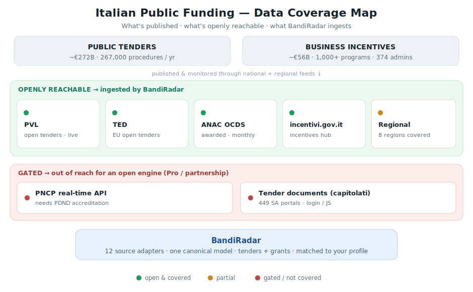

# Coverage Map — Italian Public Funding Data

*An honest map of where Italian public funding is published, what is openly
accessible, and exactly what BandiRadar covers — and what it does not.*

> Most tools that monitor Italian bandi imply broad coverage. This document does the
> opposite: it states the size of the universe, which parts are openly reachable
> versus gated, and the honest boundary of what this open engine ingests today.
> Every number is from a public source (linked below); the source inventory is the
> live state of the engine.

---

## 1. The universe

Italian public funding splits into two large classes, and — contrary to the common
assumption — the country is **consolidating** the data into national hubs, not
fragmenting it.

**Public tenders (appalti / gare).** ~**267,000 procedures**, ~**€272 billion** in
2024. Since **1 January 2024**, *all* public contracts of any amount and sector must
be handled digitally through AgID-certified platforms interoperable with ANAC's
national database (**BDNCP / PNCP**); legal publicity of tender notices moved from
the Gazzetta Ufficiale to ANAC's **Pubblicità a Valore Legale (PVL)**.

**Business incentives (agevolazioni).** ~**1,000+ programs** from **374 public
administrations**, ~**€56 billion** in value (~€13B currently active/upcoming),
aggregated on **incentivi.gov.it** and the national aid register (**RNA**). Of the
published calls, **32% come from Regions/Provinces, 31% from Municipalities, 17% from
Chambers of Commerce** — i.e. the "long tail" is largely already aggregated.

**EU tenders (TED).** Above-EU-threshold Italian tenders are also published EU-wide
on Tenders Electronic Daily.

**The structural insight.** Two/three national hubs (PNCP/PVL for tenders,
incentivi.gov.it + RNA for incentives, TED for EU-threshold) already aggregate most
of the volume and value. A genuine fragmented tail remains — regional/municipal calls
not yet on the hubs, and tender *documents* hosted on each contracting authority's own
portal — but it is the last slice, not the bulk.

---

## 2. Access reality — open vs gated

The map that matters: not "what exists" but "what is openly reachable, and how fresh."

| Data source | What it holds | Access | Freshness | BandiRadar |
|---|---|---|---|---|
| **PVL** — pubblicitalegale.anticorruzione.it | OPEN tenders (bandi di indizione) with deadlines | **Open** public JSON API, no credentials | near‑real‑time (held ≥ until deadline) | ✅ `anac_pvl` |
| **ANAC OCDS open data** — dati.anticorruzione.it | Awarded/retrospective contracts > €40k (OCDS) | **Open**, CC‑BY 4.0 | monthly | ✅ `anac` (intelligence/benchmarks) |
| **TED** — Tenders Electronic Daily | EU above‑threshold open tenders | **Open** anonymous API | daily | ✅ `ted` |
| **incentivi.gov.it + RNA** | National catalogue of business incentives | **Open** IODL open‑data export | periodic | ✅ `incentivi` ⚠️ open, but unreachable from datacenter CI runners (firewall drops Azure IPs at connect → `ConnectTimeout`); works from residential/local IPs. In the live monitor the gap is closed via an **optional HTTP relay** (operator‑deployed, `BANDIRADAR_RELAY_*` env — see README); without it, documented gap. |
| **Regional portals** (Lombardia, Lazio, Toscana, Sicilia, Emilia‑Romagna, Trentino, …) | Regional tenders & incentives | **Mixed** — Socrata / WP‑REST / Plone‑REST / CKAN / LLM‑scraper | varies | ⚠️ partial (6 regions covered; recon of the rest below) |
| **PNCP real‑time full API** | All tenders, live, sub‑threshold included | **Gated** — PDND accreditation + certified‑platform registry | real‑time | ❌ Pro / partnership lever |
| **Tender documents** (capitolati/allegati) | Full tender specs & eligibility | **Gated** — 449+ heterogeneous SA portals, mostly login/JS | n/a | ❌ measured low‑ROI (see §4) |

---

## 3. What BandiRadar covers today (v0.6.0)

Ten source adapters, each with an honest scope. Tenders **and** grants normalize
into one canonical `Opportunity` model — something neither national hub does (PNCP and
incentivi.gov.it are separate silos).

| Source | Class | Live | Nature | Note |
|---|---|---|---|---|
| `anac_pvl` | tender | ✅ | **Open tenders, near‑real‑time** | National legal‑publicity feed; open JSON API, no creds. The biddable feed. |
| `ted` | tender | ✅ | Open EU‑threshold tenders | Anonymous EU API; large Italian tenders. |
| `incentivi` | incentive | ✅ | National incentives catalogue | The official IODL open‑data export (≈ the incentives hub). |
| `anac` | tender | ✅ | Retrospective / awarded (> €40k) | Monthly OCDS; powers market **benchmarks**, not open bids. |
| `lombardia` | tender | ✅ | Regional procurement | Socrata SODA dataset (sample regional source). |
| `lazio` | incentive | ✅ | Regional incentives | LazioInnova bandi over a WP‑REST adapter. |
| `toscana` | incentive | ✅ | Regional incentives | LLM‑assisted scraper (no clean API). |
| `sicilia` | incentive | ✅ | Regional FESR/FSC incentives | EuroInfoSicilia, standard WP posts (category filter) over the WP base. |
| `emilia_romagna` | incentive | ✅ | Regional incentives | Plone `Bando` content type (plone.restapi); structured `scadenza_bando`. |
| `trentino` | incentive | ✅ | Provincial FEASR incentives | dati.trentino.it CKAN open‑data CSV; carries currently‑open bandi. |

### Regional portals — recon summary

Every territory not yet covered was probed for a usable open‑bandi API (HTTP probes
from a **datacenter IP** — the same network profile as the CI monitor, so
"unreachable here" predicts "unreachable in the monitor"). Context that shapes the
verdicts: regional **tenders** are already nationally covered (PVL legal publicity is
mandatory since 2024, plus TED), so a region's marginal value is its **incentives**
not (yet) aggregated on incentivi.gov.it. Outcomes:

| Territory | Portal probed | Verified finding | Outcome |
|---|---|---|---|
| **Sicilia** | euroinfosicilia.it (FESR) | WP‑REST OK — standard posts under a "Bandi e Avvisi" category | ✅ **covered in v0.6.0** (`sicilia`) |
| **Emilia‑Romagna** | politicheterritoriali.regione.emilia‑romagna.it | Plone 6 REST OK — structured AGID `Bando` content type | ✅ **covered in v0.6.0** (`emilia_romagna`) |
| **Trentino (PAT)** | dati.trentino.it | CKAN OK — fresh FEASR bandi‑calendar CSV with currently‑open calls | ✅ **covered in v0.6.0** (`trentino`) |
| Veneto | bandi.regione.veneto.it (SIU) | Custom, JS‑heavy; no RSS/API | 🔭 LLM‑scraper candidate |
| Piemonte | regione.piemonte.it (Drupal 9), finpiemonte.it | No WP‑REST; no `/jsonapi` exposed | 🔭 LLM‑scraper candidate |
| Puglia | sistema.puglia.it | Legacy custom portal; no API found | 🔭 LLM‑scraper candidate |
| Campania | fesr.regione.campania.it | **Unreachable from datacenter IPs** (regione.campania.it custom) | 🔭 candidate ⚠️ CI‑block risk — probe before building |
| Friuli‑VG | dati.friuliveneziagiulia.it (Socrata), regione.fvg.it | Socrata holds only retrospective contribution reports, no bandi listing; main portal custom | 🔭 LLM‑scraper candidate |
| Sardegna | sardegnaimpresa.eu (Drupal 10) | No `/jsonapi` exposed | 🔭 LLM‑scraper candidate |
| Marche | regione.marche.it/…/Bandi | Custom ASP; regional CKAN = historical gare archives only | 🔭 LLM‑scraper candidate |
| Liguria | filse.it | Joomla; no API | 🔭 LLM‑scraper candidate |
| Umbria | sviluppumbria.it | Custom; no WP‑REST | 🔭 LLM‑scraper candidate |
| Calabria | regione.calabria.it (WP) | WordPress but REST **permission‑blocked**; calabriaeuropa non‑JSON | 🔭 LLM‑scraper candidate |
| Basilicata | regione.basilicata.it (WP) | WP‑REST alive but no bandi type/category (bandi live on a separate custom portal) | 🔭 LLM‑scraper candidate |
| Abruzzo | regione.abruzzo.it, abruzzosviluppo.it | **Both unreachable from datacenter IPs** | ⏭️ skip (CI‑blocked) |
| Molise | sviluppoitaliamolise.com (WP) | WP‑REST OK but only a `project` type; minimal volume | ⏭️ skip (national hub suffices) |
| Bolzano (PAB) | provincia.bz.it; CKAN daten.buergernetz.bz.it | Custom; CKAN not pertinent to bandi | ⏭️ skip for now |
| Valle d'Aosta | regione.vda.it, finaosta.com | Custom / WP without bandi; minimal volume | ⏭️ skip (national hub suffices) |

**Datacenter‑IP blocks, stated plainly:** four probed endpoints are unreachable from
datacenter/CI IPs while working from residential ones — `incentivi.gov.it` (the
national hub, already documented in the README), `regione.abruzzo.it`,
`abruzzosviluppo.it`, and `fesr.regione.campania.it`. For an open project whose
monitor runs on CI, that is a real coverage constraint, not a code bug — so those
are skips (or build‑gates, for Campania), not silent failures.

"LLM‑scraper candidate" means the self‑healing LLM scraper pattern (`toscana`)
applies: no clean API, but public HTML bando pages an LLM can extract from — each
candidate needs the cost/freshness trade‑off measured before building.

---

## 4. The honest gap — what we do *not* cover, and why

- **Real‑time sub‑threshold tenders** beyond the monthly OCDS snapshot → the live
  full feed is **gated behind PDND accreditation** (you must be a registered certified
  platform). Out of reach for an open project; it is a **Pro / partnership** lever.
- **Tender documents (capitolati).** Measured directly: across 981 open gare the
  document links resolve to **449 distinct contracting‑authority portals**, ~**0%**
  direct PDFs, with the high‑volume platforms (SINTEL/ARIA, MEPA, regional CATs) behind
  **operator login / JavaScript**. A generic OCR fetch would silently fail on nearly
  all of them → not built. (A targeted adapter for the 2–3 most common public portals
  is the only viable future path.)
- **Incentives not yet on incentivi.gov.it** — the genuinely fragmented tail, shrinking
  as the Codice degli Incentivi pushes administrations onto the platform.
- **Regional calls beyond the sampled regions** — most live on individual regional
  portals with no common standard; we ship 3 (Lombardia, Lazio, Toscana) as references,
  not exhaustive coverage.

---

## 5. The open / Pro boundary

**Open (this repo):** the engine, the canonical model + two‑stage matcher, and the
adapters for the **open national feeds** (PVL, TED, ANAC OCDS, incentivi.gov.it) plus
reference regional sources. Everything here runs offline on bundled samples with zero
secrets.

**Commercial layer (separate):** the **maintained, always‑fresh national corpus**;
**real‑time accredited (PDND) tender access**; and delivery/multi‑tenant/hosting. The
moat is the kept dataset and the accredited pipe — not the engine, which is open.

---

## 6. Reproduce

- Universe figures: linked public sources below.
- Source inventory & health: `bandiradar doctor` (live status per source).
- Matching quality on this data: `bandiradar eval --diagnostics` (labelled corpus).

### Sources
- ANAC — *Relazione annuale 2025 sull'attività 2024*, market summary (267k procedures, €272B).
- ANAC — *Digitalizzazione contratti pubblici* (mandatory certified platforms from 1 Jan 2024).
- ANAC — *Pubblicità a Valore Legale* (legal publicity of bandi; replaces the Gazzetta Ufficiale).
- ANAC — *dati.anticorruzione.it* OCDS open data (> €40k, monthly, CC‑BY 4.0).
- MIMIT / RNA — *incentivi.gov.it: oltre 1000 incentivi e 374 amministrazioni* (€56B; 32% regioni, 31% comuni, 17% camere).
- Developers Italia — *Piattaforma dei Contratti Pubblici* (PNCP API via PDND; accredited access).
- TED — *Tenders Electronic Daily* (EU above‑threshold, anonymous API).

*Last updated: v0.6.0 · figures reflect the latest published ANAC/MIMIT data as of mid‑2026.*
